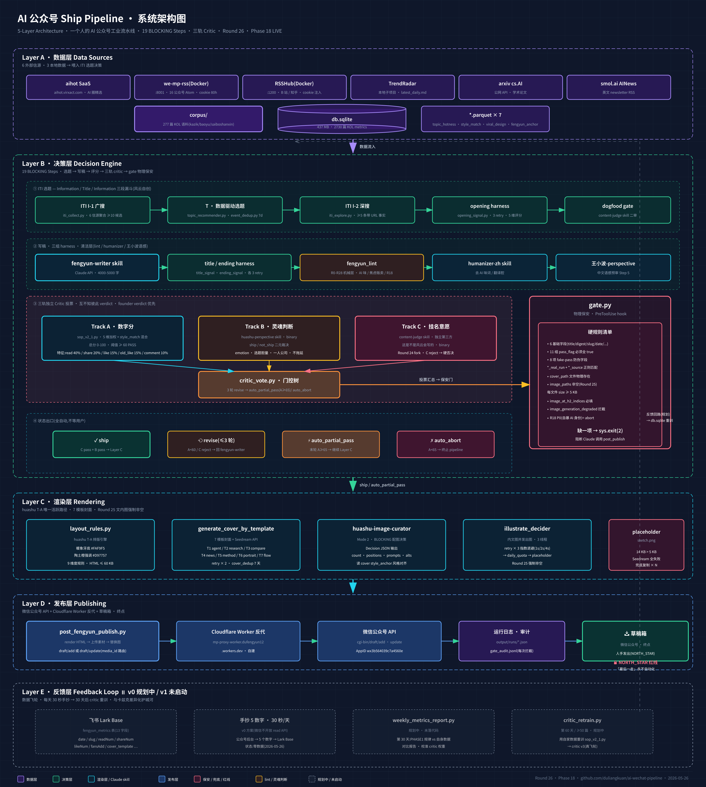
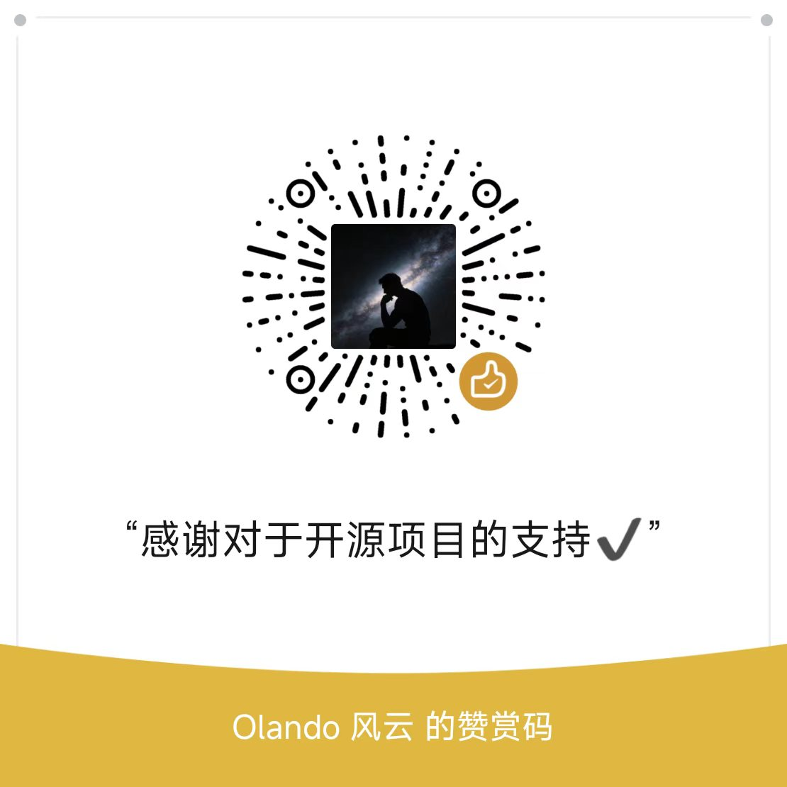

<h1 align="center">☁️ fengyun-publish</h1>

<p align="center">
  <b>单人 AI 公众号〈研究 Agent 的云〉的端到端写作发布流水线</b><br>
  <sub>选题 · 调研 · 写稿 · 三轨评审 · 排版 · 配图 · 推草稿 — 19 步全自动落到草稿箱,只留最后一击给人</sub>
</p>

<p align="center">
  <a href="LICENSE"></a>
  
  
  <a href="https://github.com/duliangkuan/fengyun-publish/commits/main"></a>
  <a href="https://github.com/duliangkuan/fengyun-publish/stargazers"></a>
</p>

<p align="center">
  <a href="#这是什么">这是什么</a> ·
  <a href="#架构">架构</a> ·
  <a href="#pipeline-19-step以-write_agentmd-为权威">19 Step</a> ·
  <a href="#快速开始">快速开始</a> ·
  <a href="#-关于作者">关于作者</a> ·
  <a href="#-公众号--交流群--支持作者">支持作者</a>
</p>

---

## 这是什么

一个**端到端的 AI 公众号写作发布流水线**,Python + Claude Code skill 编排。从「热点选题 → 深度调研 → 写稿 → 三轨评审 → 排版 → 封面 → 推草稿」一共 19 步,产出直接落到微信公众号草稿箱,作者只需要在手机上做最后一次审阅 + 发布。

**为谁建**:对标数字生命卡兹克,一个人运营 AI 赛道公众号「研究 Agent 的云」(微信号 `FengYunAgent`)。

**不是 prompt 链,是工业流水线**:

- 19 个 BLOCKING Step + 物理 `gate.py` 拦截(任一 step 没真跑过都通不过)
- 三轨独立 critic 投票(数字分 + 灵魂判断 + 挂名意愿),互不知晓彼此 verdict
- 8 项 fake-pass 防伪字段(防主线程拍脑袋写占位)
- 全自动 critic-revise loop,3 轮后走 `auto_partial_pass` / `auto_abort` 不等人
- Round 25 文内图强制非空 + `assets/placeholder-sketch.png` 兜底,绝不发裸文

---

## 架构



> 源文件:[`docs/architecture.svg`](docs/architecture.svg) · 高清 PNG:[`docs/architecture@2x.png`](docs/architecture@2x.png)

5 个 Layer 自下而上:

| Layer | 名字 | 核心组件 | 状态 |
|---|---|---|---|
| A | 数据层 | aihot · we-mp-rss · RSSHub · TrendRadar · arxiv · corpus · db.sqlite · parquet 特征矩阵 | ✅ LIVE |
| B | 决策层 | ITI 选题 → 写稿 → harness 评分 → lint → 三轨 critic → gate 保安 | ✅ LIVE |
| C | 渲染层 | `layout_rules` huashu 排版 + 7 模板封面 + 内文图 + placeholder 兜底 | ✅ LIVE |
| D | 发布层 | 微信公众号 API + Cloudflare Worker 反代 + 运行日志 + 审计 | ✅ LIVE |
| E | 反馈层 | 飞书 Base 数据飞轮 + critic 重训 | ⏸ v0 规划中 |

---

## Pipeline 19 Step(以 `WRITE_AGENT.md` 为权威)

| Step | 名字 | 脚本 / Skill |
|---|---|---|
| -1 | 北极星填空 | `output/runs/<slug>.runlog.jsonl` 第一行 |
| 0 | Voice DNA + corpus 必读 | `fengyun-writer` skill |
| 0.1 | Style 路由 | frontmatter `style:` |
| 1.0 | ITI I-1 广搜聚合候选 | `tools/iti_collect.py` |
| 1.x | topic_recommender 排序 + 7 天去重 | `tools/topic_recommender.py` · `tools/event_dedup.py` |
| 1.1 | 自动选题 + slug | runlog 写入 |
| 1.5 | 开头 harness + dogfood gate | `tools/opening_signal.py` · `tools/opening_dedup.py` |
| 2 | ITI I-2 深搜调研 | `tools/iti_explore.py` |
| 3 | fengyun-writer 写完整稿 | `fengyun-writer` skill |
| 3.3 | 标题 harness | `tools/title_signal.py` · `tools/title_dedup.py` |
| 3.5 | ending harness | `tools/ending_signal.py` · `tools/ending_dedup.py` |
| 4 | fengyun_lint 机械层 | `tools/fengyun_lint.py` |
| 4.5 | humanizer-zh 去 AI 味 | `humanizer-zh` skill |
| 5 | 王小波语感预审 | `wangxiaobo-perspective` skill |
| 6 | 三轨 critic vote(详见下节) | `tools/critic_vote.py` · `tools/sop_v2_1.py` |
| 7.1 | 配图候选位置预筛 | `tools/illustrate_decider.py::pick_candidates` |
| 7.2 | 花叔 Mode 2 配图决策(BLOCKING) | `huashu-image-curator` skill |
| 7.3 | 内文图 Seedream 生成 | `tools/illustrate_decider.py::generate_from_decision` |
| 7-cover | 封面生成 | `tools/generate_cover_by_template.py` |
| 8 | 排版 + 推草稿(gate 守门) | `tools/post_fengyun_publish.py` |
| 9 | 报告 + audit log | `tools/verify_audit.py` |

---

## 三轨 Critic + Gate 物理保安

### 三轨独立评委

| Track | 评什么 | 阈值 | 实现 |
|---|---|---|---|
| **A · 数字分** | 综合爆款率预测(0-100) | ≥ 60 PASS | `tools/sop_v2_1.py`(5 维加权 + style_match 25% 混合) |
| **B · 灵魂判断** | ship / not_ship(花叔视角) | binary | `huashu-perspective` skill |
| **C · 挂名意愿** | 这是不是风云会写的开头 | binary | `content-judge` skill(独立第三方,Round 24 fork) |

### 门控树(`tools/critic_vote.py::gate_tree`)

```
A 缺            → abort(工具链断)
A < 60          → revise
C reject        → revise(C 硬否决,founder verdict 优先)
C pass + B pass → ship
C pass + B reject → human_gate(3 轮 revise 后)
B skip + C skip → pass(System A 单轨兜底)
```

3 轮 revise 后自动出口(Round 24):末轮 A≥65 → `auto_partial_pass`(继续 Step 7-8);A<65 → `auto_abort`(不推草稿)。

### Gate 物理保安(`tools/gate.py`)

PreToolUse hook,主线程调 `post_fengyun_publish.py` 之前拦一刀:
- **11 组 pass_flag 必须全 true**(writer / title / ending / lint / humanizer / wangxiaobo / critic_vote / huashu_decision / cover / image)
- **8 项 fake-pass 防伪**:每个 step 不仅要 `*_pass: true`,还要 `*_real_run: true` + `*_source` 字段,source 内容必须匹配正则
- **Round 25 image 硬规则**:`image_paths` 非空 + 每文件 size ≥ 5 KB + `image_at_h2_indices` 必填
- **R18 自我暴露分级**:P0(自暴 AI 身份)→ `aborted_r18` 立即终止
- 缺任一 → `sys.exit(2)` 阻断 Claude 调用

---

## 技术栈

**语言**
- Python 3.x — 48 个 `tools/` 脚本,15,016 行
- PowerShell 5.1 — preflight / run_trendradar / run_rsshub / headless_ship

**关键库**(从 import 归纳,暂无 `requirements.txt`)
- `pandas` · `numpy` — 评分特征 + parquet 读写
- `anthropic` — Claude API
- `python-dotenv` — 凭证加载
- `urllib.request` — 微信 API 直连(避开 requests 减少依赖)
- `concurrent.futures.ThreadPoolExecutor` — Seedream 并发出图
- `xml.etree.ElementTree` — RSS 解析

**外部服务**

| 服务 | 用途 | 凭证字段 |
|---|---|---|
| 微信公众号 API | 推草稿 + 素材上传 | `WECHAT_APPID` · `WECHAT_SECRET` |
| Cloudflare Worker 反代 | 自建,解决官方代理不稳 | `mp-proxy-worker.dufengyun12.workers.dev` |
| 火山引擎方舟 Seedream | 封面 + 内文图生成 | `VOLCENGINE_IMAGE_KEY` |
| Anthropic Claude | 所有 skill 底层 | `ANTHROPIC_API_KEY` |
| aihot REST API | I-1 广搜信源 | 免费 |
| we-mp-rss(Docker localhost:8001) | 16 个公众号 Atom feed | 扫码 cookie,~80 小时有效 |
| RSSHub(Docker localhost:1200) | B 站 / 知乎 feed | 浏览器 cookie 注入,见 [`docs/rsshub_cookie_setup.md`](docs/rsshub_cookie_setup.md) |
| TrendRadar | 综合日报 | `D:\Dev\TrendRadar` 本地子项目 |
| arxiv · smol.ai | 学术 + 英文 newsletter | 免费 |
| 飞书 Lark Base | 数据飞轮表(v0) | `LARK_*` |

---

## 目录结构

```
fengyun-publish/
├── tools/              48 个核心脚本(写稿/lint/critic/排版/封面/推送)
├── output/             运行产物(大部分 gitignore,仅 diagrams + 部分 patch 入 git)
├── docs/               技术决策文档(SPEC_ROUND25 / LAYOUT_RULES / rsshub 教程)
├── reports/            Phase 1-18 调研报告(80+ 篇沙盒辩论结果)
├── vendor/             开源依赖 clone(gitignore,各自有 .git)
├── assets/             静态资源(placeholder-sketch.png Round 25 兜底)
├── mp-proxy-worker/    Cloudflare Worker 反向代理源码
├── bin/                编译工具(md2wechat.exe gitignore)
├── WRITE_AGENT.md      ⭐ 系统级宪法(19 Step 全流程,最高优先级)
├── CLAUDE.md           项目级上下文(关键路径 + 决策记录)
├── PLAN.md             v2 实施方案
├── NORTH_STAR.md       北极星(两大核心模块)
└── PHASE1_FACTS.md     2730 篇 KOL 数据分析事实
```

> 注:KOL 语料(原 `corpus/` 目录,kazik/baoyu/saiboshanxin/huashu 等
> 第三方文章节选)与历史草稿(`output/drafts/`、`output/research/`)
> **不随本开源仓库一同分发**,详见 [`NOTICE.md`](NOTICE.md)。

---

## 快速开始

**前提**:Windows + PowerShell · Python 3.x · Docker · Claude Code CLI。

### 1. clone + 装依赖

```powershell
git clone https://github.com/duliangkuan/fengyun-publish.git
cd fengyun-publish
pip install -r requirements.txt
```

### 2. 配凭证

```powershell
copy .env.example .env
# 填入:WECHAT_APPID / WECHAT_SECRET / VOLCENGINE_IMAGE_KEY / ANTHROPIC_API_KEY 等
```

### 3. 启动 Docker 容器

```powershell
# we-mp-rss(公众号 feed)
docker run -d --name we-mp-rss -p 8001:8001 ghcr.io/rachelos/we-mp-rss:latest

# RSSHub(B 站/知乎,需 cookie)
# 详见 docs/rsshub_cookie_setup.md
```

### 4. preflight 全绿

```powershell
.\tools\preflight.ps1
```

7 项 P0 必须全 PASS / WARN。任一 FAIL 必须先修。

### 5. 触发 ship(在 Claude Code 主对话中)

通过 `fengyun-publish` skill 触发(自然语言即可):

> 「ship 一篇关于 Claude Code Auto Mode 的稿子」

主线程会自动跑完 19 Step,最后把草稿落到微信公众号草稿箱,作者在手机上做最后一次审阅 + 发布。

---

## 关键概念

| 词 | 含义 |
|---|---|
| **huashu**(花叔) | 项目内固定指克制版排版,暖象牙底 `#FAF9F5` + 陶土橙 `#D97757`。Round 21 锁定为唯一活跃渲染路径 |
| **fengyun**(冯运) | 项目作者笔名 + 公众号主理人;脚本前缀 |
| **ITI** | Information-Title-Information,风云自创三段漏斗:I-1 广搜 → T 数据驱动选题 → I-2 深搜 |
| **critic 三轨** | Track A 数字分 + Track B 灵魂判断 + Track C 挂名意愿,gate_tree 投票 |
| **Round** | 系统迭代轮次(当前 26);通常对应一次重要机制改动 |
| **Phase** | 项目宏观阶段(当前 18 活跃);对应 `reports/phaseN_*.md` 调研 |
| **gate** | 物理门控保安(`tools/gate.py`),PreToolUse hook 拦截 |
| **SOP** | critic 多维评分系统(`tools/sop_v2_1.py`) |
| **NORTH_STAR** | 永不自动化的红线:草稿箱最后一击必须人手完成 |

---

## Phase 进度

| Phase | 主题 | 状态 |
|---|---|---|
| 1 | 语料 + skill 装机 | ✅ LIVE |
| 2 | 端到端手工验证 | ✅ LIVE |
| 3 | 自动化 + 自评层骨架 | ✅ LIVE |
| 4 | critic 沙盒辩论 + 反馈环 | ✅ LIVE |
| 5 | 封面 + 配图系统 | ✅ LIVE |
| 6 | 排版深度优化 | ✅ LIVE |
| 7 | 封面模板 5→7 + 100% 实测 | ✅ LIVE |
| 8 | 信源升级(22→52) | ✅ LIVE |
| 9 | critic-revise loop 修复 | ✅ LIVE |
| 10-16 | 上云调研 | ⏸ 暂停等本地完善 |
| 17 | RSSHub 信源迁移 | ✅ LIVE |
| 18 | Feed 健康诊断 | ✅ LIVE(最新) |

---

## 不在 git 里的东西(clone 后缺什么)

| 类别 | 路径 | 怎么补 |
|---|---|---|
| 🔴 凭证 | `.env` · `tools/.wechat_token.json` | 见 `.env.example` 填 |
| 📦 数据库 | `db.sqlite`(437 MB,2730 篇 KOL metrics) | 重跑数据采集,或从作者本地备份恢复 |
| 📦 特征矩阵 | `*.parquet`(7 个) | 由脚本从 `db.sqlite` 重算 |
| 📦 KOL 语料 | `corpus/` 整目录(开源版已移除) | 自行抓取,遵守版权 |
| 🔁 开源依赖 | `vendor/`(5 个子项目) | 各自 git clone |
| 🛠️ 二进制工具 | `bin/md2wechat.exe` | 重新编译 / 下载 |
| 🗑️ 中间态 | `output/runs/` · `output/render/` · `output/images/` | 跑一次 pipeline 自动生成 |

---

## 安全说明

- **绝不**把 `.env` 或 `tools/.wechat_token.json` 提交到 git(已被 `.gitignore` 拦截)
- 微信 `access_token` 7200 秒有效,本地缓存安全
- 若复用本管道做自己的公众号,**抓取的 KOL 文章请勿对外公开分发**(版权敏感),仅供本机风格分析用
- 任何 cookie 字符串(B 站 / 知乎 / 公众号)只放本地 Docker 环境变量

---

## 🤝 关于作者

**风云**(冯运),公众号「研究 Agent 的云」主理人。一个人运营 AI 赛道公众号,
所有发出的文章都是用这套 pipeline 跑出来的——README 里你看到的每一个 step,
都是在我自己公众号上反复试过的活物,不是设计草稿。

这是我的第一个 MIT 开源项目,欢迎 ⭐ star / 提 issue / 拍砖 / PR。

| 渠道 | 怎么找到我 |
|---|---|
| 📰 **公众号** | 研究 Agent 的云(微信搜索关注) |
| 💬 **微信号** | `FengYunAgent`(加好友请备注「来自 GitHub」) |
| 📧 **邮箱** | 2330304961@qq.com |
| 🐙 **GitHub** | [@duliangkuan](https://github.com/duliangkuan) |

---

## 📱 公众号 · 交流群 · 支持作者

> **如果这个项目对你有帮助:**
> 扫码关注公众号 → 看真实在跑的产出长什么样。
> 想和我以及其他独立 AI 公众号主理人聊技术与运营,加交流群。
> 觉得值,可以请我喝杯咖啡 ☕,但 star 更值钱。

<!--
TODO 风云上传三张图到 assets/ 后,取消下面这段 HTML 注释:

<table align="center">
  <tr>
    <th align="center">关注公众号</th>
    <th align="center">加交流群</th>
    <th align="center">请我喝咖啡 ☕</th>
  </tr>
  <tr>
    <td></td>
    <td></td>
    <td></td>
  </tr>
  <tr>
    <td align="center"><sub>研究 Agent 的云</sub></td>
    <td align="center"><sub>群活码 · 不定期更新</sub></td>
    <td align="center"><sub>这一杯让我多写几个 Step</sub></td>
  </tr>
</table>
-->

> 公众号 / 交流群 / 赞赏码二维码补充中(`assets/wechat_official_qr.png`、`assets/wechat_group_qr.png`、`assets/wechat_reward_qr.png`)。
> 在那之前想第一时间联系作者,直接搜微信号 `FengYunAgent`,备注「来自 GitHub」会优先通过。

---

## 📜 License

[MIT](LICENSE) · Copyright (c) 2026 duliangkuan(冯运,笔名「风云」)

衍生作品请保留 [`NOTICE.md`](NOTICE.md) 里的致谢清单(卡兹克 / 宝玉 / 花叔 / 赛博山新)。
